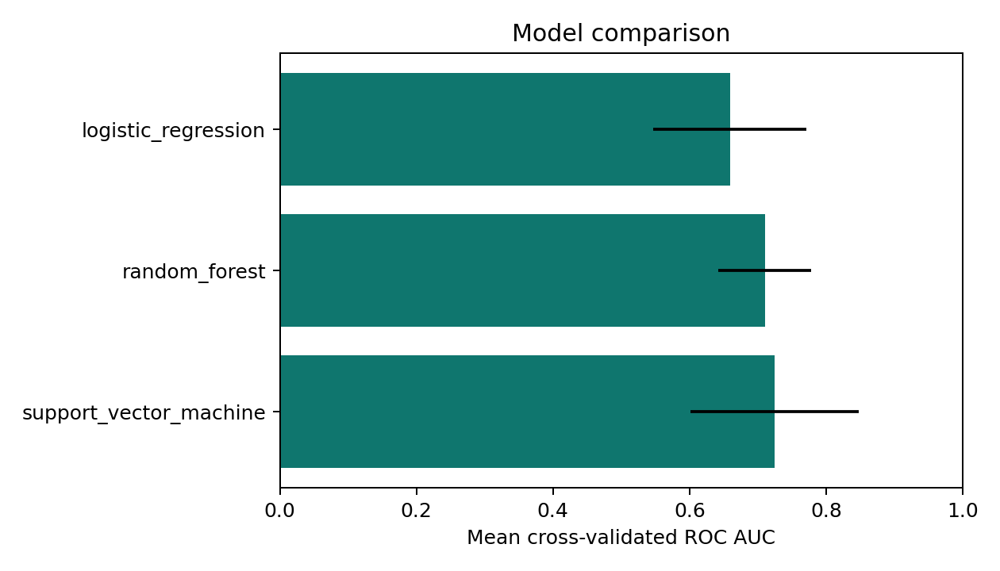
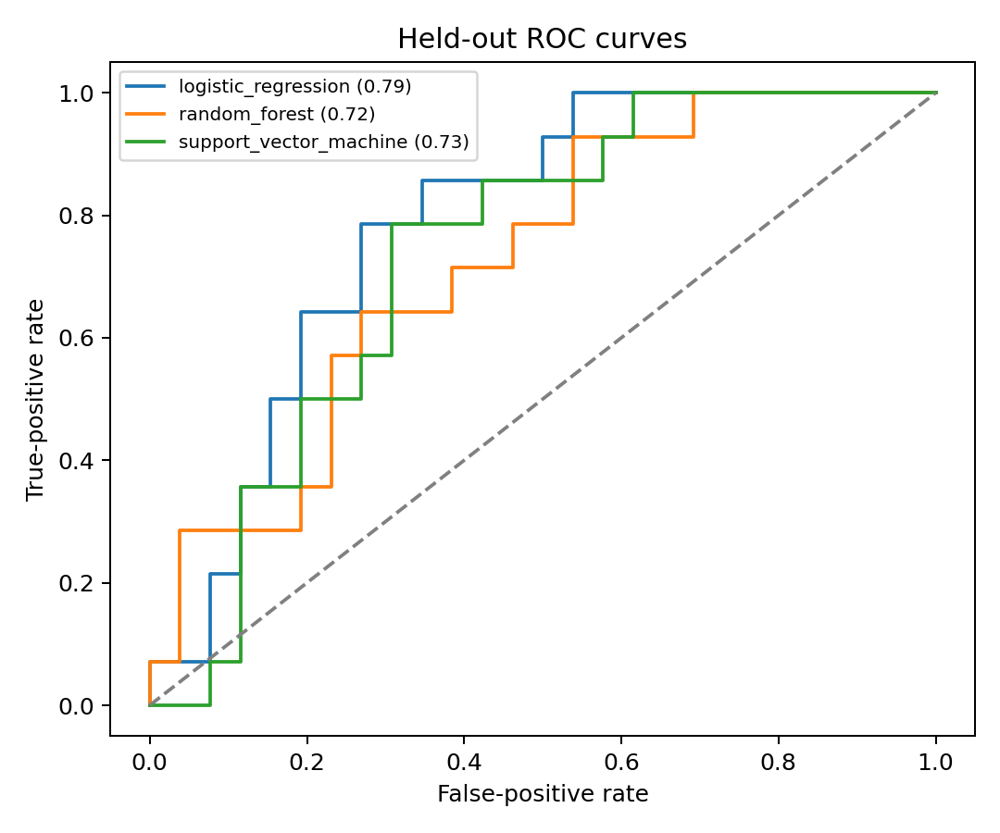
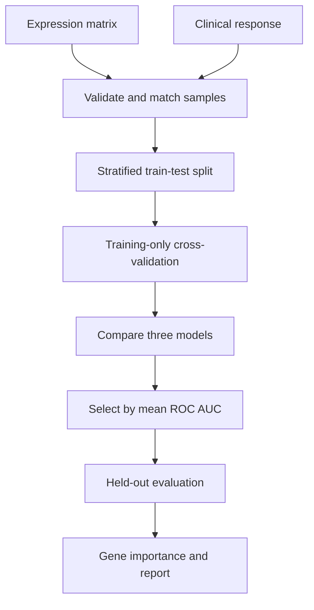

# Immunotherapy Response Prediction

[](https://www.python.org/)
[](https://scikit-learn.org/)
[](LICENSE)

A reproducible bioinformatics and machine-learning workflow for predicting binary cancer immunotherapy response from bulk gene-expression profiles. The project covers data validation, exploratory analysis, dimensionality reduction, leakage-safe feature selection, multi-model comparison, cross-validation, held-out evaluation, gene-level interpretation, visualization, and automated reporting.

> **Research and education only.** This repository is not a medical device. Synthetic demonstration results have no clinical meaning, and results from a real cohort require independent validation before scientific or clinical interpretation.

## Research question

Can pretreatment tumor gene-expression patterns distinguish patients who respond to immunotherapy from those who do not?

The target is binary:

- `1`: response, such as responder, complete response, or partial response
- `0`: non-response, according to the definition selected for the cohort

Response definitions vary between studies. The exact mapping must be documented before cohorts are combined.

## Highlights

- Accepts CSV, TSV, `.csv.gz`, and `.tsv.gz` inputs
- Matches expression and clinical data using unique sample identifiers
- Detects missing columns, duplicate IDs, inadequate sample sizes, and invalid targets
- Keeps imputation, variance filtering, feature selection, and scaling inside each model pipeline
- Compares logistic regression, random forest, and support vector machine models
- Selects the leading model using stratified cross-validation on the training set only
- Preserves an untouched held-out test set for final evaluation
- Reports ROC AUC, average precision, balanced accuracy, F1, precision, and recall
- Produces PCA, class balance, model comparison, ROC, precision-recall, and gene-importance figures
- Saves the fitted model, predictions, tables, machine-readable summary, and written report
- Includes deterministic synthetic data for installation checks
- Includes automated tests for both the compact and full workflows

## Example output

The repository includes a clearly labeled synthetic demonstration so the expected output can be inspected without downloading a biomedical dataset.





## Workflow



## Repository structure

```text
.
├── analyze.py                       # Complete multi-model analysis
├── train.py                         # Compact logistic-regression baseline
├── src/
│   ├── immunotherapy_model.py       # Input validation and baseline training
│   └── full_analysis.py             # EDA, CV, comparison, interpretation, reporting
├── tests/
│   ├── test_pipeline.py             # Baseline workflow tests
│   └── test_full_analysis.py        # End-to-end analysis tests
├── notebooks/
│   └── 01_complete_analysis.ipynb    # Executable analysis walkthrough
├── examples/synthetic_demo/          # Versioned example figures and tables
├── data/
│   ├── raw/                         # Unmodified local data, not committed
│   └── processed/                   # Analysis-ready local data, not committed
├── requirements.txt
└── LICENSE
```

## Installation

```bash
git clone https://github.com/palrabheru/immunotherapy-response-prediction.git
cd immunotherapy-response-prediction
python -m venv .venv
```

Activate the environment:

```bash
# Windows PowerShell
.venv\Scripts\Activate.ps1

# macOS or Linux
source .venv/bin/activate
```

Install dependencies:

```bash
python -m pip install --upgrade pip
python -m pip install -r requirements.txt
```

## Fast verification

Run the compact baseline:

```bash
python train.py --demo --output-dir outputs/baseline_demo
```

Run the complete project:

```bash
python analyze.py --demo --output-dir results/demo
```

Run all tests:

```bash
python -m pytest -q
```

## Input format

### Expression table

One row per sample and one column per gene:

| sample_id | CD274 | PDCD1 | IFNG | GZMB |
|---|---:|---:|---:|---:|
| SAMPLE_001 | 4.21 | 2.18 | 5.04 | 3.77 |
| SAMPLE_002 | 1.92 | 0.84 | 2.11 | 1.56 |

Gene columns must be numeric or convertible to numeric. All-missing columns are removed. If genes are rows and samples are columns, transpose the matrix before using this pipeline.

### Clinical table

| sample_id | response |
|---|---|
| SAMPLE_001 | Responder |
| SAMPLE_002 | Non-responder |

The sample ID must be unique in each table. Default positive labels include `1`, `true`, `yes`, `responder`, `response`, `cr`, and `pr`. When labels differ, pass the positive class explicitly.

## Run with a real cohort

```bash
python analyze.py \
  --expression data/processed/expression.tsv.gz \
  --clinical data/processed/clinical.csv \
  --sample-column sample_id \
  --target-column response \
  --positive-label Responder \
  --top-k 50 \
  --test-size 0.25 \
  --seed 42 \
  --output-dir results/cohort_01
```

## Modeling strategy

Each candidate receives the same preprocessing pipeline:

1. Median imputation learned from training samples
2. Removal of zero-variance genes
3. ANOVA-based selection of the top `k` genes
4. Standardization learned from training samples
5. Classification with balanced class weights

The three candidates provide complementary baselines:

| Model | Purpose | Main strength |
|---|---|---|
| Logistic regression | Linear reference model | Interpretable direction and magnitude |
| Random forest | Nonlinear ensemble | Captures interactions and nonlinear effects |
| RBF support vector machine | Kernel model | Flexible boundary in selected feature space |

Model selection uses mean cross-validated ROC AUC. The test set is not used to choose the model.

## Generated results

```text
results/demo/
├── REPORT.md
├── analysis_summary.json
├── best_model.joblib
├── figures/
│   ├── class_distribution.png
│   ├── model_comparison.png
│   ├── pca_by_response.png
│   ├── precision_recall_curves.png
│   ├── roc_curves.png
│   ├── sample_expression_distribution.png
│   └── top_gene_importance.png
└── tables/
    ├── cross_validation_results.csv
    ├── permutation_importance.csv
    └── test_predictions.csv
```

## Interpreting the metrics

- **ROC AUC** measures ranking across classification thresholds.
- **Average precision** is especially useful when responders are uncommon.
- **Balanced accuracy** gives equal weight to the two classes.
- **Precision** asks how many predicted responders truly responded.
- **Recall** asks how many actual responders were detected.
- **F1** balances precision and recall.

Accuracy alone can look strong in an imbalanced cohort even when responder recognition is weak.

## Feature interpretation

The complete workflow uses held-out permutation importance. Each gene is shuffled while other inputs stay fixed, and the decrease in ROC AUC is recorded. Larger decreases indicate stronger predictive contribution to that fitted model. Importance is not causation, and correlated genes can share or mask importance.

## Data-source note

The early notebook references GEO accession **GSE176307**. Its available metadata must be checked carefully because a dataset suitable for tumor microenvironment exploration does not automatically contain a usable responder/non-responder endpoint. Do not infer clinical response labels from expression patterns.

## Reproducibility checklist

- Random seed recorded in the JSON summary
- Stratified splitting used for class balance
- Preprocessing fitted inside each training fold
- Test samples excluded from model selection
- Complete predictions saved for auditing
- Dependencies constrained in `requirements.txt`
- Generated data and models excluded from Git by default
- Synthetic outputs explicitly labeled

## Limitations and next steps

- Add an independently curated real immunotherapy cohort with verified response labels.
- Use grouped splitting if several samples belong to one patient.
- Address study and sequencing batch effects without using test-set information.
- Add nested cross-validation for formal hyperparameter tuning.
- Estimate confidence intervals through repeated resampling or bootstrapping.
- Assess probability calibration and clinically meaningful decision thresholds.
- Validate leading genes through pathway enrichment and external evidence.
- Perform external-cohort testing before presenting a biomarker claim.

## License

MIT. See [LICENSE](LICENSE).
